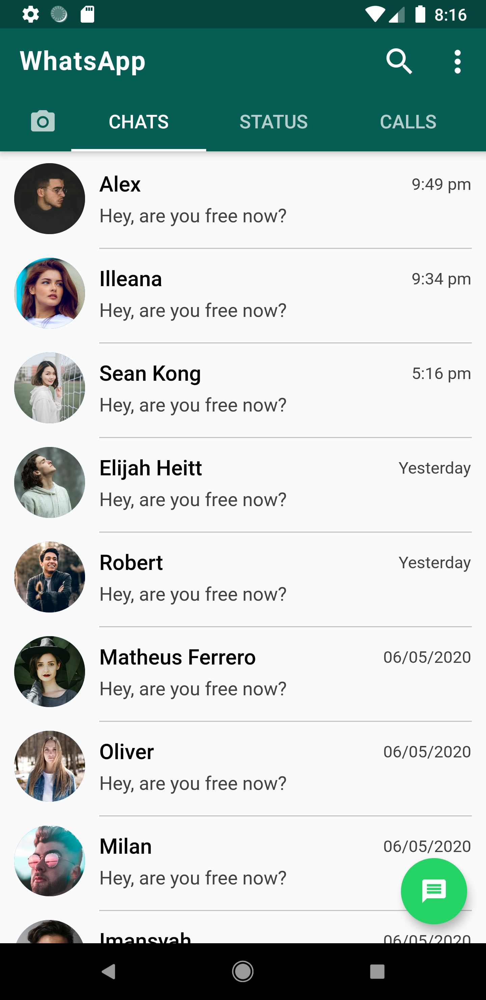
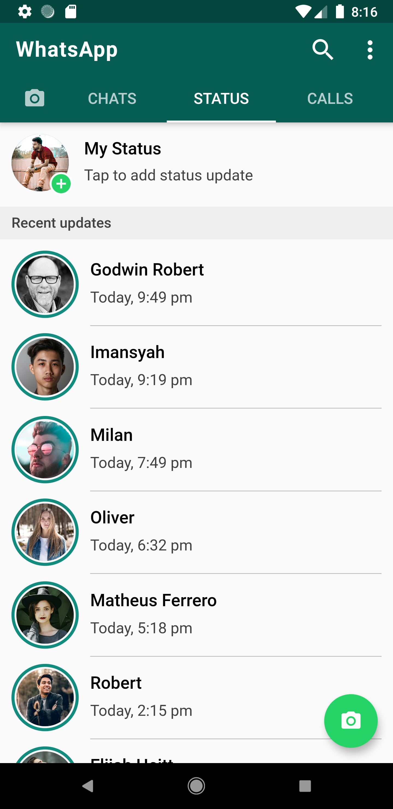
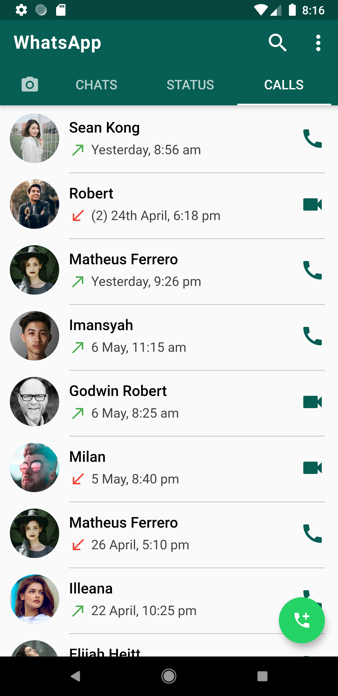
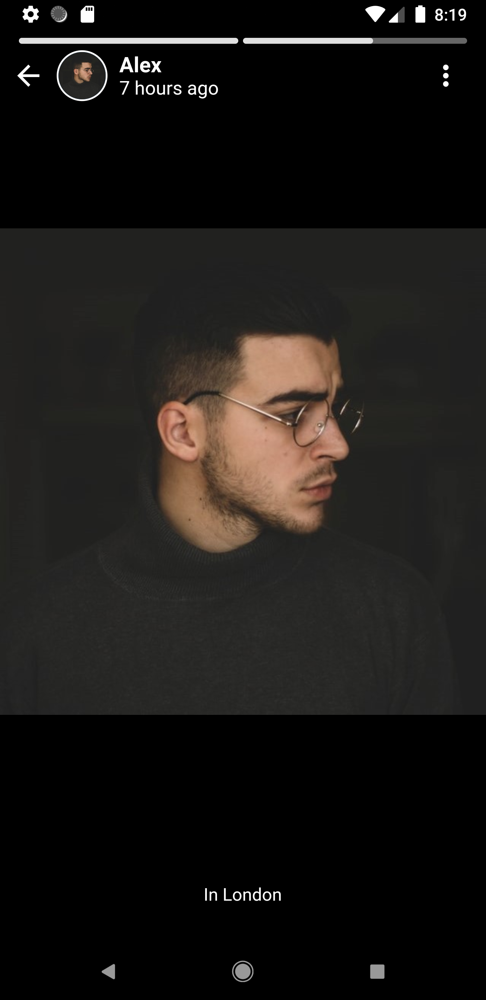
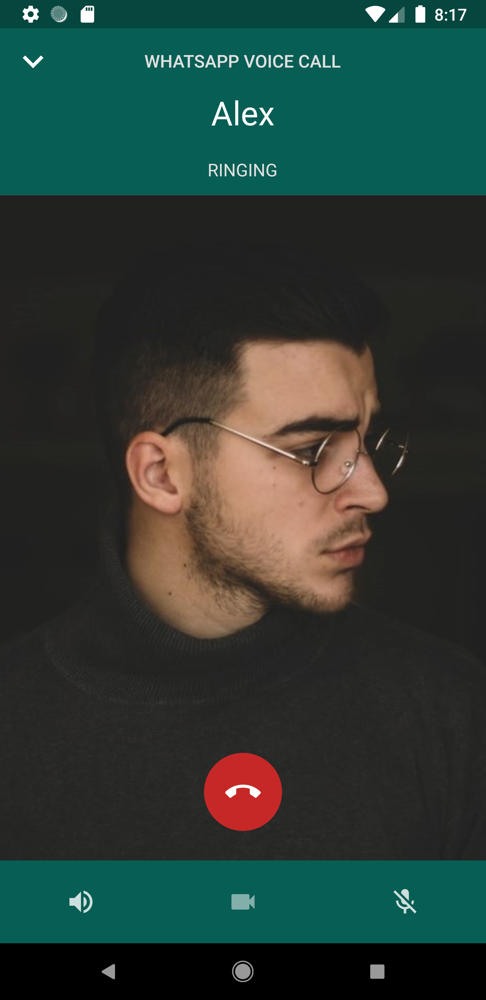
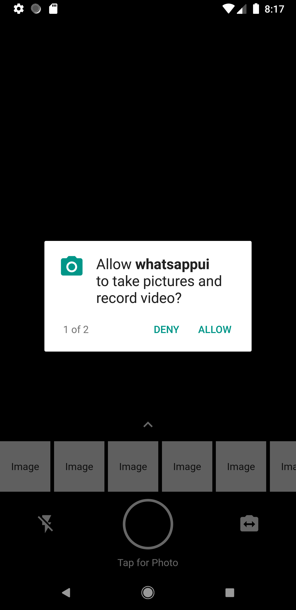
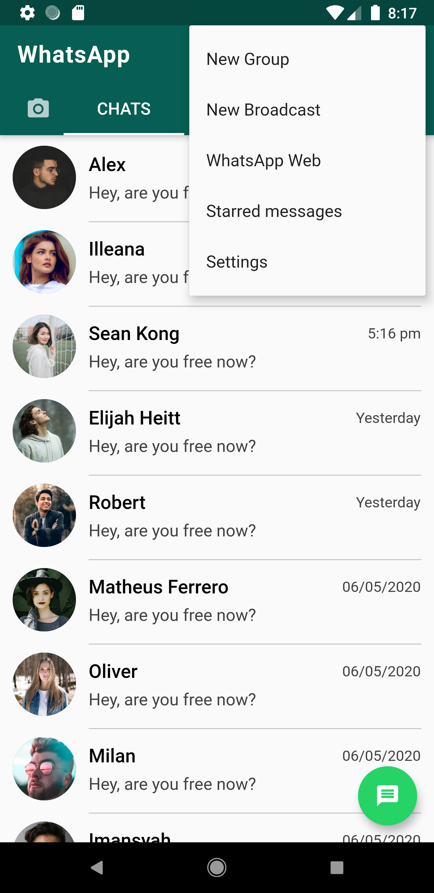
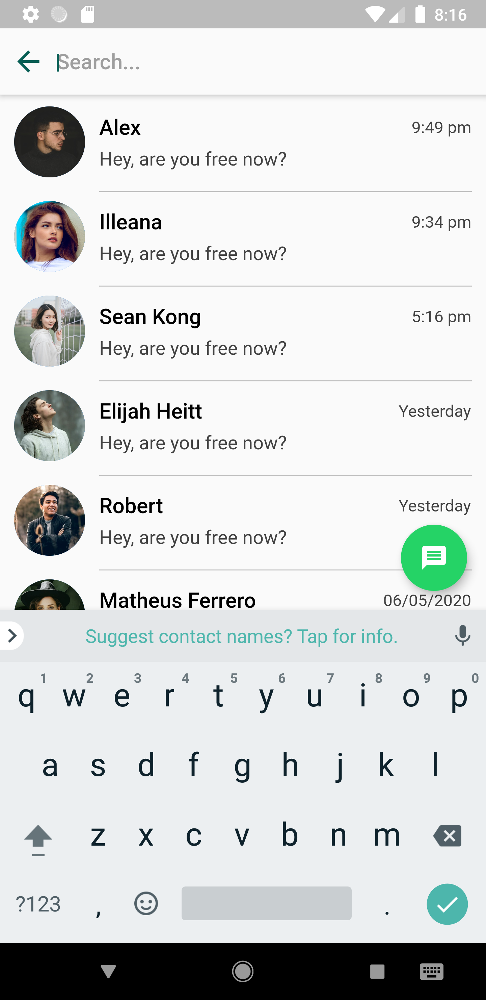
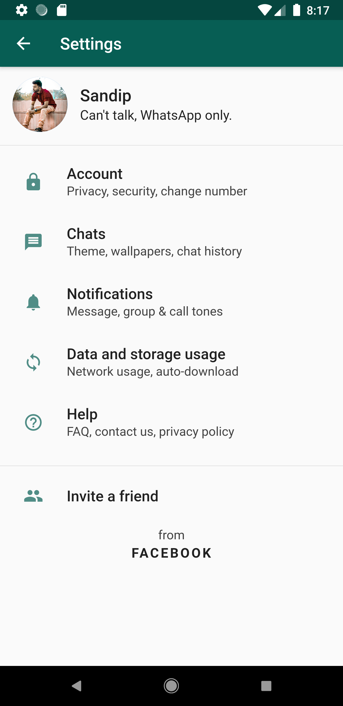

# WhatsApp UI

WhatsApp UI clone made with Flutter.

## Screenshots

 
<table><tr>
 <td style="text-align: center">
 
 </td>
 <td style="text-align: center">
 
 </td>
 <td style="text-align: center">
 
 </td>
 </tr></table>
 

 
 
<table><tr>
 <td style="text-align: center">
 
 </td>
 <td style="text-align: center">
 
 </td>
 <td style="text-align: center">
 
 </td>
 </tr></table>
 

 
  
<table><tr>
 <td style="text-align: center">
 
 </td>
 <td style="text-align: center">
 
 </td>
 <td style="text-align: center">
 
 </td>
 </tr></table>
 

 
   
<table><tr>
 <td style="text-align: center">
 
 </td>
 <td style="text-align: center">
 
 </td>
 </tr></table>
 

